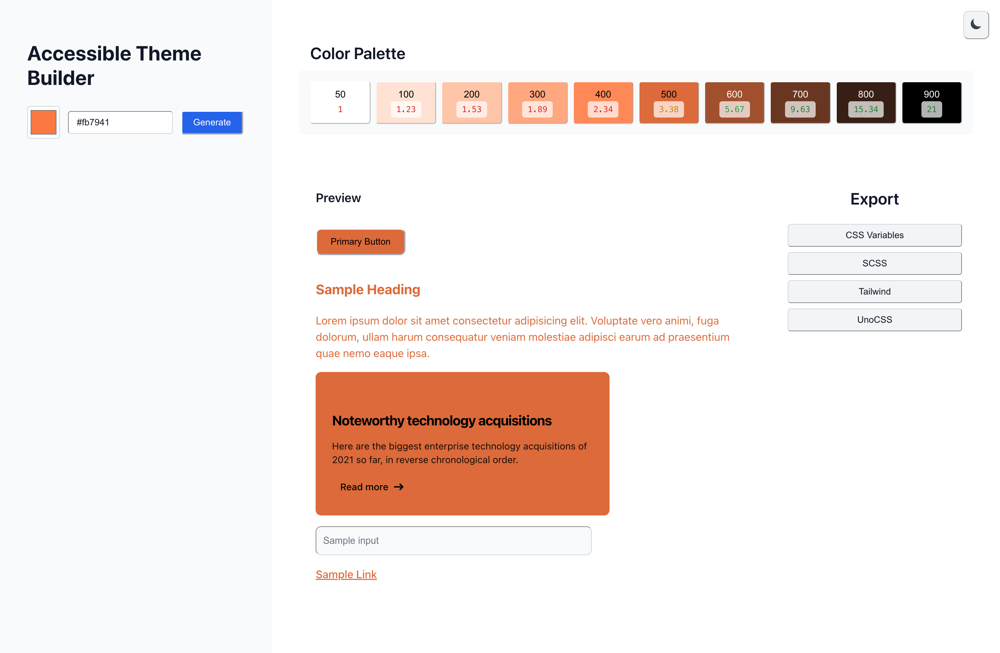
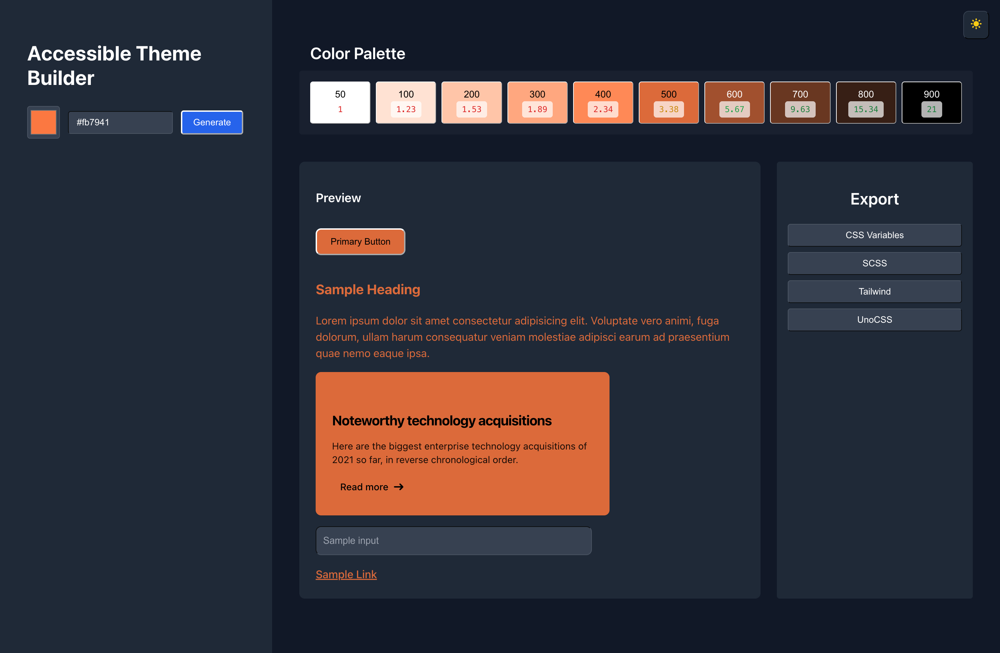

# Accessible Theme Builder

**Accessible Theme Builder** is an open-source tool that helps developers generate **WCAG-compliant color palettes**.  
Check contrast ratios, preview UI components, and **export design tokens** for multiple frameworks (CSS, SCSS, Tailwind, UnoCSS).  
Build **accessible, consistent, and portable design systems** with ease.

---

## Screenshots




---

## Features

### Core Functionality
- Generate color palettes from a brand/base color (10 shades: 50-900)
- Real-time **WCAG contrast ratio checks** with visual indicators:
  - Green: AAA (7+) / AA (4.5+) compliant
  - Yellow: AA Large (3+) compliant
  - Red: Does not meet WCAG standards
- Live preview of UI components (buttons, cards, text, inputs, links)
- Export tokens in multiple formats:
  - CSS Variables
  - SCSS Maps
  - Tailwind Config
  - UnoCSS Config

### Dark Mode Support
- System preference detection (prefers-color-scheme)
- Manual toggle with sun/moon icons
- All components fully themed for light and dark modes

### Accessibility
- Proper ARIA labels on all interactive elements
- Screen reader friendly with descriptive labels
- Full keyboard navigation support
- Focus ring indicators throughout
- Semantic HTML structure (button elements for clickable items)

### Responsive Design
- Mobile-first responsive layout
- Flexible grid system:
  - Mobile: 2 columns
  - Tablet: 3-5 columns
  - Desktop: 10 columns
- Stacked panels on mobile, side-by-side on desktop

### Modern Toast Notifications
- Tailwind-styled success/warning alerts
- Slide-in/out animations
- Auto-dismiss (2.5s success, 3.5s warning)
- Mobile responsive

---

## Tech Stack

- **Vue 3** - Composition API with script setup
- **Vite** - Fast development and build tool
- **Uno CSS** - Instant on-demand atomic CSS engine
- **Chroma.js** - Color manipulation and palette generation
- **@madhusha_99/notification-center** - Toast notifications

---

## Getting Started

### Prerequisites

- Node.js 18+
- npm or yarn

### Installation

```bash
# Clone the repository
git clone https://github.com/MadhushaPrasad/accessible-theme-builder.git

# Navigate to the project
cd accessible-theme-builder

# Install dependencies
npm install

# Start development server
npm run dev
```

### Build for Production

```bash
npm run build
```

---

## Project Structure

```
src/
├── App.vue                     # Main app with dark mode state
├── style.css                   # Global styles and toast animations
├── components/
│   ├── ColorPicker.vue         # Brand color input with picker
│   ├── ContrastBadge.vue       # WCAG contrast ratio display
│   ├── ExportPanel.vue         # Export buttons and toast notifications
│   ├── PaletteGrid.vue         # Color palette grid display
│   └── PreviewPanel.vue        # UI component previews
└── composables/
    ├── useColorEngine.js       # Color generation and contrast calculations
    └── useExporters.js         # Export format generators
```

---

## Usage

1. **Select a Brand Color**: Use the color picker or enter a hex value
2. **Generate Palette**: Click "Generate" to create a 10-shade palette
3. **Review Contrast**: Check WCAG compliance via color-coded badges
4. **Preview Components**: See how colors look on real UI elements
5. **Export Tokens**: Copy design tokens in your preferred format

---

## Export Formats

### CSS Variables
```css
:root {
  --primary-50: #eff6ff;
  --primary-100: #dbeafe;
  /* ... */
}
```

### Tailwind Config
```javascript
module.exports = {
  theme: {
    extend: {
      colors: {
        primary: {
          50: '#eff6ff',
          100: '#dbeafe',
          /* ... */
        }
      }
    }
  }
}
```

---

## Contributing

Contributions are welcome! Please feel free to submit a Pull Request.

1. Fork the repository
2. Create your feature branch (`git checkout -b feature/amazing-feature`)
3. Commit your changes (`git commit -m 'Add some amazing feature'`)
4. Push to the branch (`git push origin feature/amazing-feature`)
5. Open a Pull Request

---

## License

This project is open source and available under the [MIT License](LICENSE).
